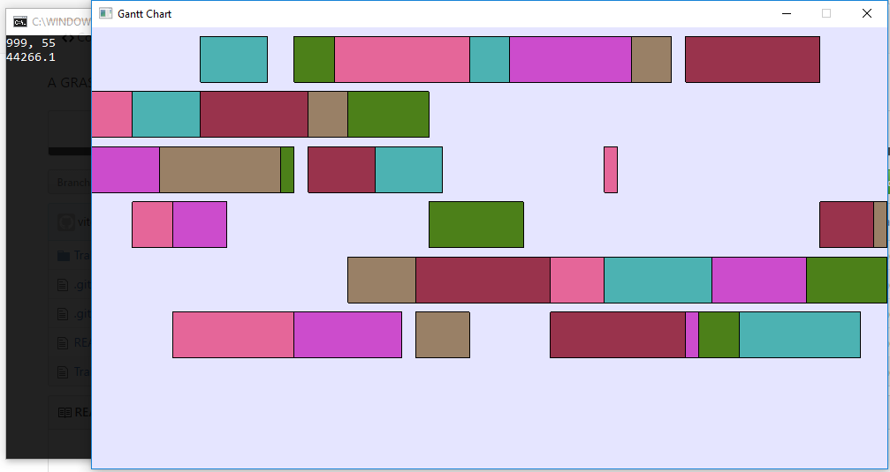

# GRASP-Flexible-Job-Shop-Problem
 Implementa a meta-heuristica GRASP para resolver o problema Flexible-Job-Shop-Problem, ao finalizar a busca renderiza um gráfico de gantt representando a melhor solução encontrada.

